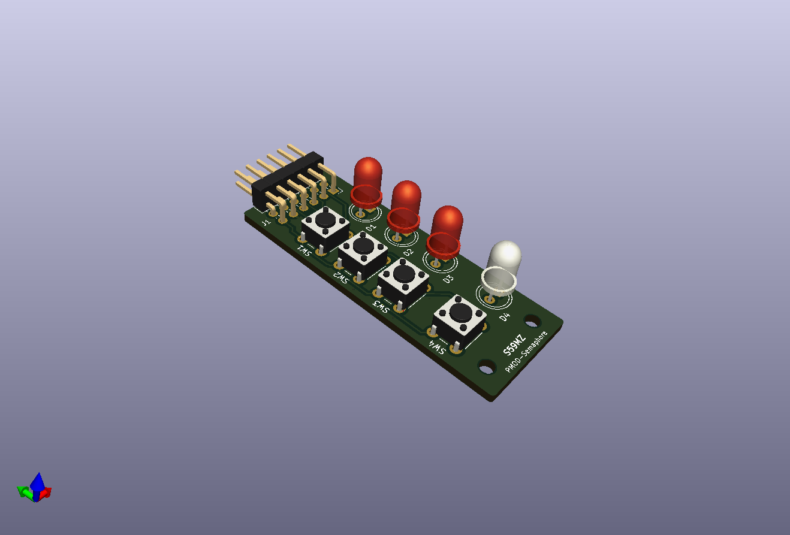
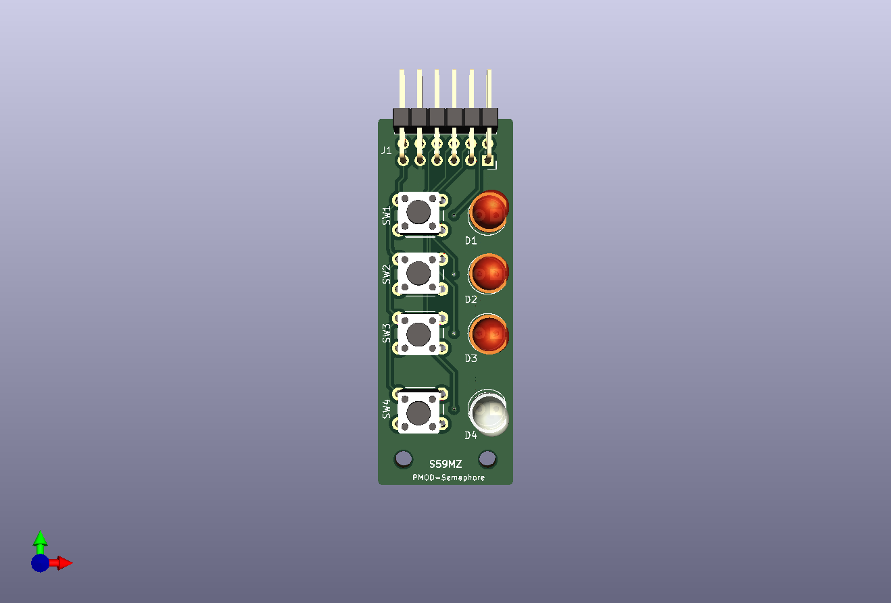
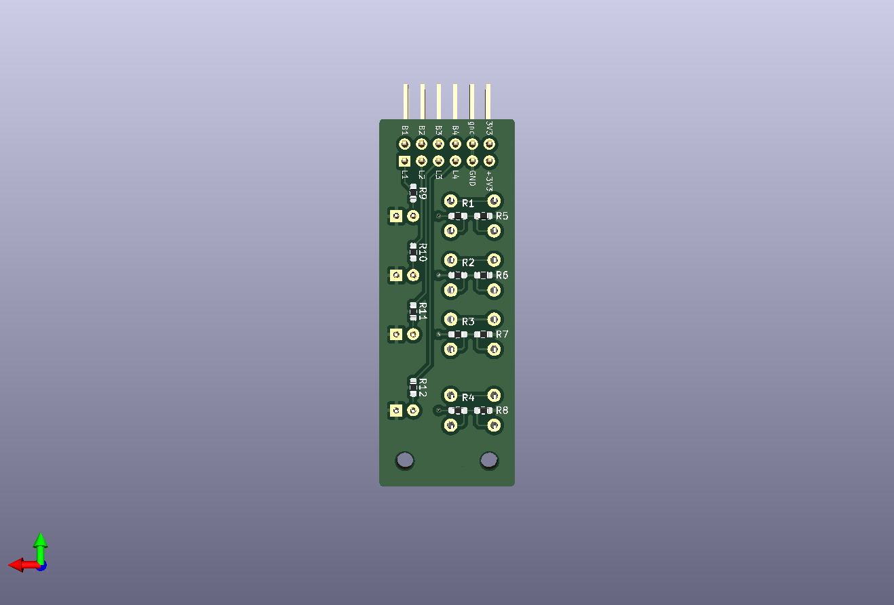

# kicad-pmod-semaphore
Just a simple push-buttons and LEDs PMOD module

Schematic:
[kicad-pmod-semaphore.pdf](kicad-pmod-semaphore.pdf)

BOM:
[kicad-pmod-semaphore.csv](kicad-pmod-semaphore.csv)

Gerbers:
[gerbers.zip](https://github.com/s59mz/kicad-pmod-semaphore/raw/main/gerbers.zip)
